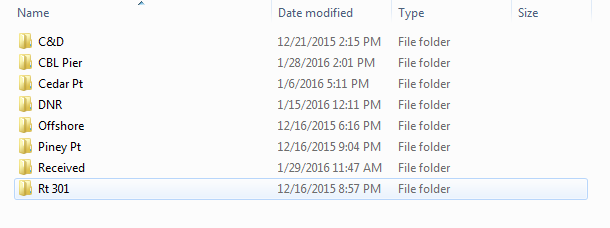
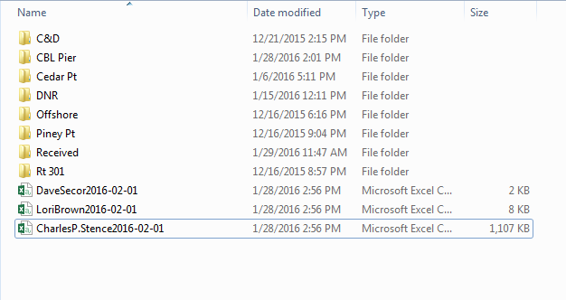

## Introduction and a disclaimer

This code was written so that I could quickly and easily send any detected VEMCO transmitters to those who have provided their tag IDs to the [ACT database](http://www.theactnetwork.com). I'm definitely not an expert coder, please feel free to help me out or report bugs at [TelemetyR's GitHub](https://github.com/mhpob/TelemetryR).


## Data organization

The way that I, personally, have taken to storing detection data has been on a server owned by CBL. Since an off-site backup takes place nightly and I can access the data via the internet, this has been more useful than leaving everything in a local folder created by the [VUE software](http://vemco.com/products/vue-software/).

On this server, I have a folder which contains all detections, separated by arrays.



...and the files spit out by VUE in each array's subfolders.


## Utilizing `vemsort`

`vemsort` takes the directory you provide and looks for all *.csv* files within all folders and subfolders, assuming that they will be the *.csv* files provided by VUE. It does a bit of manipulation, including converting the UTC date and time to local time (provided by your computer) and pulling out the tag standard. I also prefer working with lower-case names in `R`, so the columns are renamed in the process.

```{r}
library(TelemetryR)
vemsort('p:/obrien/biotelemetry/detections')
```

If you want to go on and play with the detection data, you can pull out your own detections and stop here.


## Splitting things using `ACTsplit`

`ACTsplit` needs a local version of the [ACT database](http://www.theactnetwork.com) in RData format to function. `ACTupdate` creates a this for you in the working directory. Note that you'll need to create a token (the function should walk through this) to access ACT using your Dropbox account You can save this token in your working directory if you only want to do this once.

`ACTsplit` leans on `vemsort` to load all of the detections into R. Because of this, there are a few more arguments to the function: those that go to `vemsort` and those specific to `ACTsplit`. You can also provide `ACTsplit` with an object previously created by `vemsort`. This is useful if you need to do more manipulation than `vemsort` offers before you disperse your detections to ACT. Note that the function also spits out a data frame of detections not identified by the ACT data base.

`ACTsplit` will create divvied up *.csv* files and place them in the folder you specified as the directory.



Done!

## A couple of tweaks that may be needed

If you don't want the *.csv* files to be written in your working directory, you can choose `write = F` or specify a different output folder in the `out` argument.

```{r, eval = F}
ACTsplit(directory = 'p:/obrien/biotelemetry/detections',
         write = F, out = 'c:/users/secor lab/desktop')
```

You can also provide personal detections and give a date range for which detections you want (make sure the date is in year-month-day format).

```{r, eval = F}
# Splits detections from June 1 up to and including August 1, 2014
ACTsplit(directory = 'p:/obrien/biotelemetry/detections',
         my.trans = paste0('A69-1601-',seq(25434,25505)),
         start = 20140601, end = 20140801)
```

Good luck, and contact me with any questions!